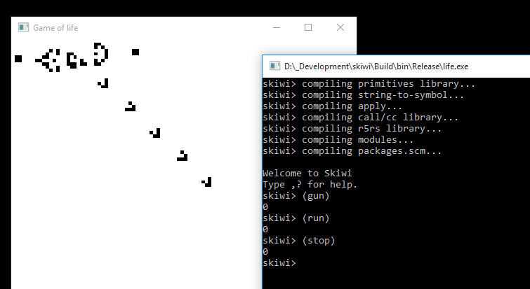

# skiwi
Scheme compiler in c++

Introduction
------------

Skiwi is a just-in-time Scheme compiler for the x86-64 instruction set. The compiler
converts Scheme source code to assembly, which is then translated to machine code and 
executed immediately.

I was inspired/have mainly used the following sources when working on this compiler:

[An incremental approach to compiler construction, Abdulaziz ghuloum.](http://scheme2006.cs.uchicago.edu/11-ghuloum.pdf)

[Bones scheme compiler](http://www.call-with-current-continuation.org/bones/)

[Guile](https://www.gnu.org/software/guile/)

[Ken Silverman's evaldraw compiler](http://advsys.net/ken/download.htm)

Building the compiler
---------------------

The compiler has been tested on Windows 10 using Visual Studio 2017 and on Ubuntu 18.04.4
with gcc 7.5.0.

First you'll need to make sure that Intel's TBB library installed. 
On Windows you can download TBB's binaries from its website, and install them, preferably, in 
folder C:\Program Files\TBB. Another folder is also possible, but then you'll need to
adapt the CMakeLists.txt file and make it point to the correct location.
On Ubuntu you can simply run 
  sudo apt install libtbb-dev 
to install TBB.

Next a solution file / makefile can be generated with CMake. Use Visual Studio or make to build the code.

When running the skiwi repl (e.g. via the "s.exe" or "./s" executable program that you've just built) the compiler will still need to build some basic functionality. This functionality is written in scheme, and the code resides in the scm subfolder of the libskiwi folder. The compiler expects that the environment variable SKIWI_MODULE_PATH exists and points to this folder. The scm folder can be placed anywhere on your harddrive as long as SKIWI_MODULE_PATH points to it. Make sure that you use only slashes (/) and not backslashes (\) when entering the path in the SKIWI_MODULE_PATH variable. Also make sure that you end the path with a slash, e.g. "C:/skiwi/scm/".

As soon as SKIWI_MODULE_PATH is correctly initialised you are ready to go.

Using the compiler as a stand-alone repl
----------------------------------------

A repl can be started by running the s program. 

Simply type your scheme code here and get immediate feedback.
Any scheme code you type is compiled to machine code and run. All compiled expressions reside in virtual memory until you close the application. 

A very basic module system is implemented that allows you to import additional functionality. Essentially it is a stripped version of the module system of [Chibi scheme](https://github.com/ashinn/chibi-scheme). For the implementation, see modules.scm in subfolder libskiwi/scm/core.
The module system allows to import additional functionality, e.g.:

    skiwi> (import 'csv)       ;; functionality for reading and writing comma separated value files
  
    skiwi> (import 'srfi-1)    ;; load srfi 1 functionality.
  
    skiwi> (import 'test-r4rs) ;; run unit tests for r4rs functionality (written by [Aubrey Jaffer](http://people.csail.mit.edu/jaffer/))
  
    ...
  
See libskiwi/scm/packages.scm for the currently defined modules. You can always add your own modules here.

Integration with slib
---------------------
I've been working to integrate skiwi with [slib](http://people.csail.mit.edu/jaffer/SLIB). There are still issues probably but some slib functionality can be used. First you'll have to install slib. Unpack the slib distribution to your folder of liking and make an environment variable SCHEME_LIBRARY_PATH that points to this folder. Then, start skiwi and type 

    skiwi> (import 'slib)
You should now be able to use the slib functionality.

Integrate skiwi as scripting language in your c++ program
-----------------------------------------------------------
In this section I'll explain how skiwi can be integrated in your c++ program by looking at the Game of Life example code that is in the repository.
Skiwi is designed as a library that you can include in your own project. You only have to include the libskiwi.h header file and you're good to go.
I assume you are familiar with Conway's Game of Life, if not, take a look at the [Wikipedia page](https://en.wikipedia.org/wiki/Conway%27s_Game_of_Life). Essentially it is a cellular automaton with the following two rules:
-  If a cell is on and has either two or three neighbors that are on in the current generation, it stays on; otherwise, the cell turns off.
 - If a cell is off and has exactly three “on” neighbors in the current generation, it turns on; otherwise, it stays off. 
 
When you run the "life" project from the repository, you'll see that the skiwi repl is available in the console window, and one additional window is opened, representing the current state of the Game of Life grid. 

In the console window, type

    skiwi> (run)
to see the next generations. Similarly type

    skiwi> (stop)
to stop computing and visualizing new generations. If you want to turn a particular cell on or off, type

    skiwi> (set-cell 4 5)
or

    skiwi> (clear-cell 9 7)
Effectively skiwi has made our Game of Life programmable during execution. We can control the game by interacting with it via the skiwi repl.
For an overview of all the extra "Game of Life" related functionality, type

    skiwi> ,external

We'll now go over the steps you need to take to make a c++ application scriptable with skiwi.

First, you need to add skiwi to your code. It is sufficient to `#include <libskiwi.h>` in your code. Then you need to register your custom skiwi functions with your application, start the skiwi repl, and finally, at the end, clean up everything:

    skiwi::scheme_with_skiwi(&register_functions); // start scheme compiler skiwi
    skiwi::skiwi_repl(); // start the skiwi repl
    skiwi::skiwi_quit(); // clean up skiwi
    
`skiwi::scheme_with_skiwi(&register_functions)` initializes skiwi. Optionally you can provide this method with extra user data as a `void*` pointer, and you can provide custom `skiwi_parameters` if you need more heap memory for instance. We'll focus on `register_functions` more deeply below.

`skiwi:skiwi_repl(int argc, char** argv)` will start a read eval print loop (repl). You can provide parameters 'argc' and 'argv'. Any file that is provided in this way will be read, compiled, and executed.

`skiwi::skiwi_quit()` cleans up everything before closing the application.

`register_functions` will be used to register our custom functions in skiwi. If you don't want to register any functions, you can keep it very simple:

    void* register_functions(void*)
      {
      return nullptr;
      }
      
In Game of Life we have however added a couple of functions to skiwi. Here `register_functions` looks like this:

    void* register_functions(void*)
      {
      using namespace skiwi;
      register_external_primitive("resize", (void*)&scm_resize, skiwi_void, skiwi_int64, skiwi_int64, "(resize w h) resizes the Game of Life grid to w x h cells.");
      register_external_primitive("randomize", (void*)&scm_randomize, skiwi_void, "(randomize) fills the Game of Life grid with random cells.");
      register_external_primitive("clear", (void*)&scm_clear, skiwi_void, "(clear) clears the Game of Life grid.");
      register_external_primitive("next", (void*)&scm_next, skiwi_void, "(next) shows the next generation of the Game of Life grid.");
      register_external_primitive("run", (void*)&scm_run, skiwi_void, "(run) starts the Game of Life simulation.");
      register_external_primitive("stop", (void*)&scm_stop, skiwi_void, "(stop) stops the Game of Life simulation.");
      register_external_primitive("game-sleep", (void*)&scm_game_sleep, skiwi_void, skiwi_int64, "(game-sleep <number>) waits <number> milliseconds between generations.");
      register_external_primitive("set-cell", (void*)&scm_set_cell, skiwi_void, skiwi_int64, skiwi_int64, "(set-cell <x> <y>) sets cell (x,y) on");
      register_external_primitive("clear-cell", (void*)&scm_clear_cell, skiwi_void, skiwi_int64, skiwi_int64, "(clear-cell <x> <y>) sets cell (x,y) off");
      register_external_primitive("gun", (void*)&scm_gun, skiwi_void, "(gun) generates the Gosper glider gun");
      register_external_primitive("space-rake", (void*)&scm_space_rake, skiwi_void, "(space-rake) generates the space-rake");
      register_external_primitive("spaceship", (void*)&scm_spaceship, skiwi_void, "(spaceship) generates the spaceship or glider");
      return nullptr;
      }

Inside `register_functions` we call `skiwi::register_external_primitive` to register a c++ function with skiwi.
The first argument to `skiwi::register_external_primitive` is the scheme name for the procedure that you want to register, then follows the address to the c/cpp function that you want to call from skiwi. The third argument is the return type of the function. The next arguments are the types of the c++ function arguments if the c++ function has any. Finally, the last argument of `skiwi::register_external_primitive` is a help text that will be shown when you type `,external` in the skiwi prompt.

The available return/argument types are

    skiwi_bool
    skiwi_char_pointer
    skiwi_double
    skiwi_int64
    skiwi_scm
    skiwi_void    
All types should be straightforward, except for `skiwi_scm` which is special. If you use `skiwi_scm` you will receive a `uint64_t` value as input that will represent a skiwi value. To interpret it correctly you need to understand how skiwi stores its information in the registers, see file runtime.cpp for more info. You can also use `skiwi_scm` as return value, allowing to write data from your c++ application to the skiwi heap.

